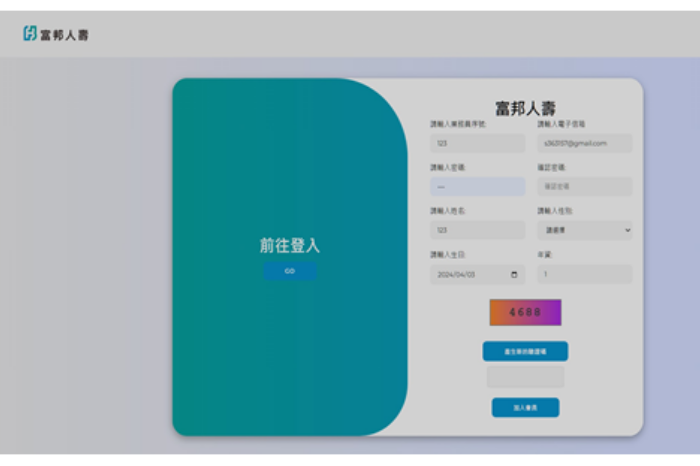
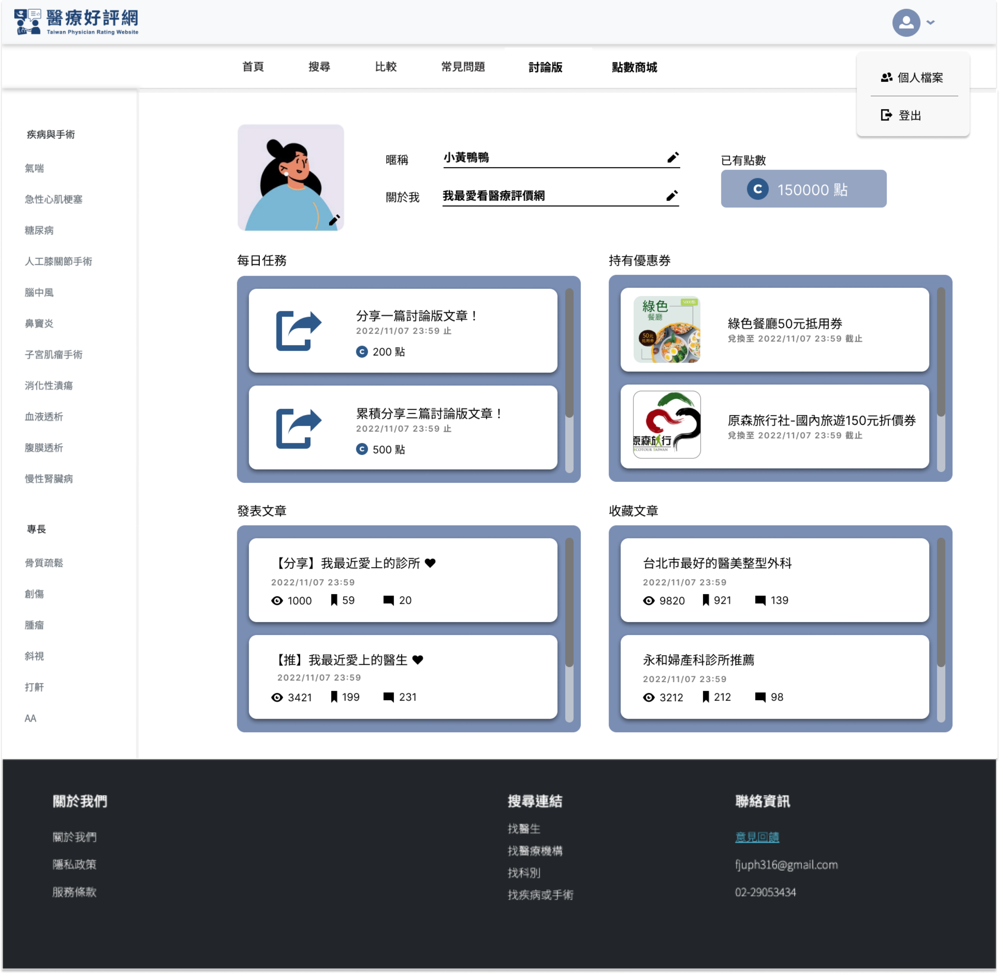
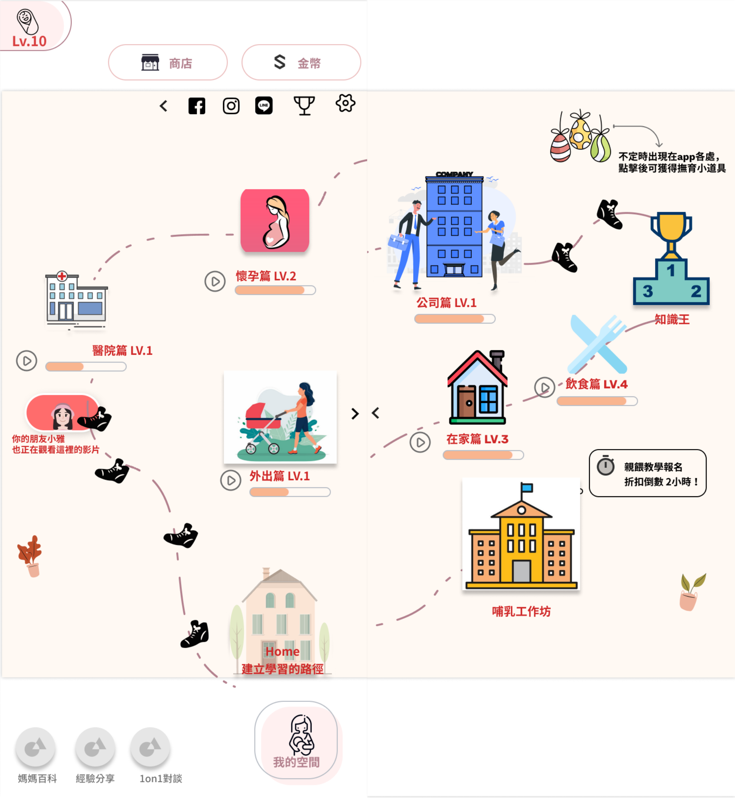
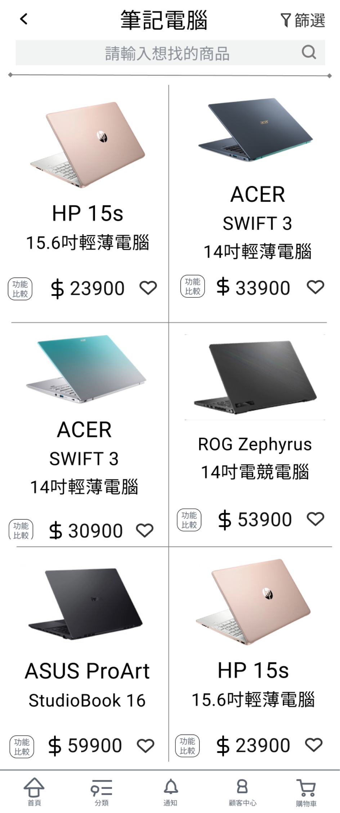

# Lola Tseng UX Designer Portfolio

> Design inspired by everyday life 生活中不是缺少美，而是缺少發現美的眼睛

Turning everyday observations into thoughtful digital experiences.

從日常觀察、使用者故事與真實情境出發，設計清楚、溫暖且能被持續使用的數位產品。

**6 個作品・InnoConnect+ 企業金獎・AI 協作打造 2 個真實產品**

- [View Projects](#work)
- [Let's Connect](#contact)
---

## Work {#work .projects}

> Selected projects

### Portfolio System

以 Markdown 管理作品集內容，透過**自製的 build 腳本**自動產生網頁，降低更新成本並保留視覺一致性。

#MarkdownCMS #靜態網站產生器 #AI協作

### Petal Log

以產品設計流程，結合 UX 方法與 **AI Vibe Coding** 完成一個簡易紀錄女性生理期的網站。

#VibeCoding #使用者研究 #MVP

### 尋保家 Quest for Home Safety

與業師合作開發 AI 保險介面，運用**決策樹**加速業務員找到適合推銷給顧客的商品。

#決策樹 #保險科技 #AI推薦

### 醫療好評網 Taiwan Physician Rating Website

完成醫療平台原型，通過 **3 位使用者測試**驗證導覽結構，提升搜尋任務成功率。

#易用性測試 #敏捷開發 #使用者研究

### 衛了教你餵母乳 The Nurture Way

運用遊戲化八角框架設計出讓使用者願意持續使用的衛教 APP，獲 **InnoConnect+ 企業金獎**。

#遊戲化設計 #八角框架 #服務設計

### 電商平台介面優化 Innovation and Design Thinking

針對電商比較功能重新設計介面，任務完成率高達 **97%**，資訊可讀性顯著改善。

#服務藍圖 #易用性測試 #電商優化

---

## AI 應用學習經歷 {#ai-learning .ai-journey}

> Continuous learning

### 已掌握：Vibe Coding 實戰

從 0 到 1 打造兩個真實上線的產品——這個作品集網站與 Petal Log，涵蓋需求釐清、介面設計到前端實作的完整流程。

### 學習中：系統化精進

2026.06 開始同步進行 Google 數位人才探索計畫與 Claude 101 課程，把單次的 Vibe Coding 經驗整理成可複製、可延伸的方法。

### 人機協作心法

把 AI 當討論夥伴：先想清楚問題框架，再讓 AI 生成內容；結果跟預期不同就換個提問角度，滾動式調整而不是砍掉重練。也因此更在意 AI 常見的誤解與答非所問——這其實是值得被設計解決的人機互動問題，換個切入點提問往往就能找到答案，而不只是「AI 不夠聰明」。

---

## About {#about .about}

> My Story

### About me

做決定時，我習慣先自己想透多個方向，再找人討論，從交集裡收斂出答案；真心相信一件事時，我不會勉強妥協，而是花時間說服大家，讓共識剛好落在我原本想的方向。

朋友常吐槽我「東西很多」，但擺放一定有自己的邏輯——這種「什麼都想收藏、但收藏要有系統」的個性，大概也是我一頭栽進資訊架構的原因。

設計上，我相信先聽懂需求比急著提出解法更重要，原型要快、技術要盡量隱形，好的體驗往往藏在日常生活的小細節裡。

目前聚焦在 UX Design 與 AI 應用，期待把技術轉化成更直覺的使用經驗。

#### Skills

- UX Design
- User Research
- Service Design
- AI
- Frontend

---

## Process {#process .process}

> Design process

1. Observe
2. Research
3. Define
4. Ideate
5. Prototype
6. Test
7. Iterate

---
<!-- 
## Playground {#playground .playground}

> Playground

### Interaction sketches

未完成的微互動、介面草稿與快速原型。

### AI experiments

嘗試把 AI 放進研究整理、內容生成與互動流程中。

### Visual notes

從展覽、旅行、電影與書籍累積的視覺觀察。

---

## Journal {#journal .journal}

> Design notes

### 如何用 AI 協助 MVP 的早期探索

2026.07

### 從資訊焦慮看 UX 的信任設計

2026.06

### Letterboxd 的觀影紀錄為什麼讓人願意持續使用

2026.05

---

## Life {#life .life}

> Inspiration

| Chinese Pop Songs | Craft Fair | In-depth travel | Movies | Dramas | Novels |
| --- | --- | --- | --- | --- |
| Playlists | Weekend finds | City walks | Movie details | Dramas details | Reading notes |
-->

---

## Contact {#contact .contact}

> Let's talk

### Hi Lola, I want to tell you...

你可以把合作邀請、作品集回饋或想聊的產品問題寄給我。

- [Email me](mailto:lola.jy.tseng@gmail.com)
