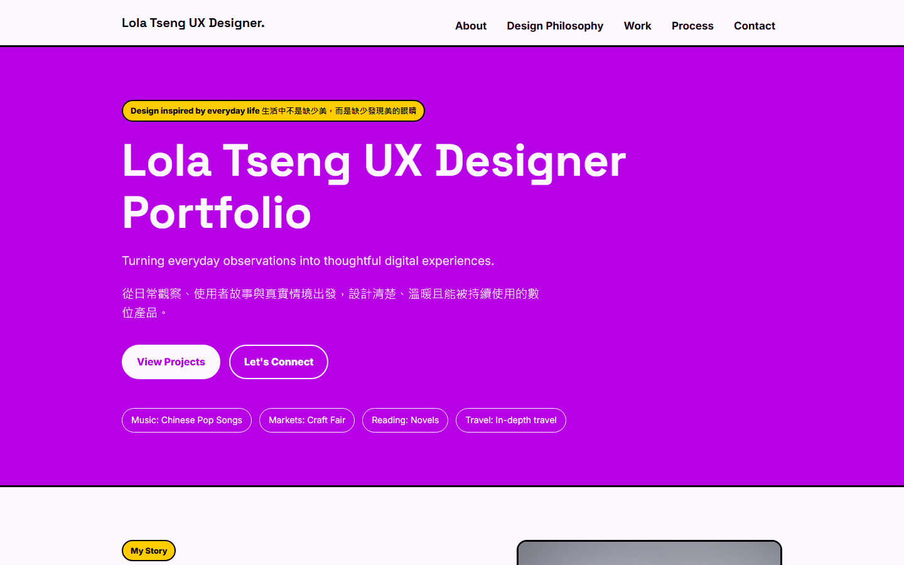
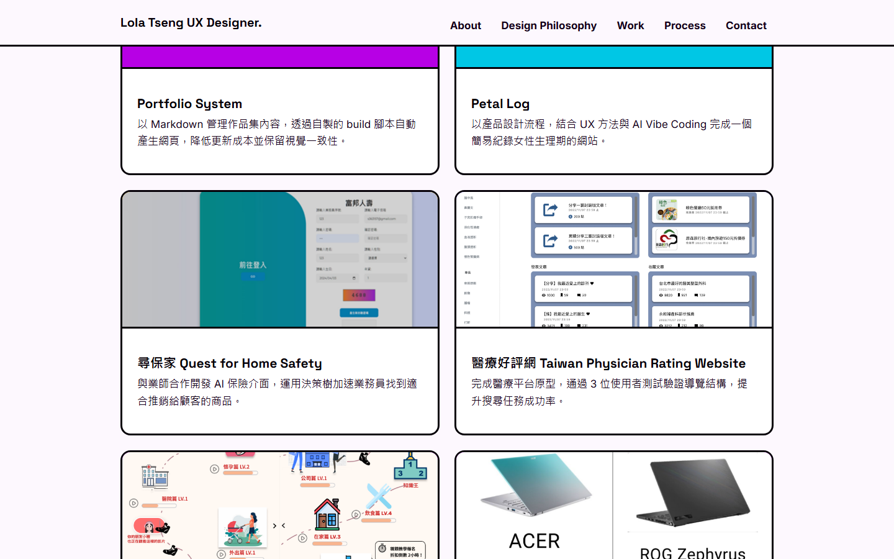
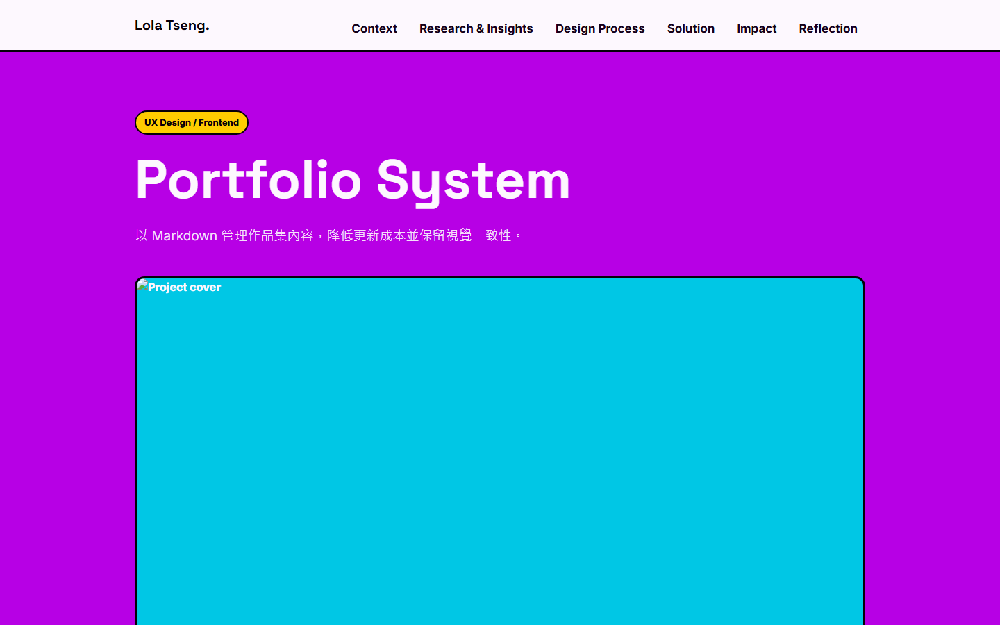

# Portfolio System

> Project Type: UX Design / Frontend

以 Markdown 管理作品集內容，透過自製的 build 腳本自動產生網頁，降低更新成本並保留視覺一致性。

---

## Project Snapshot

| Role | Team | Project Duration | Tools | System Scope |
| --- | --- | --- | --- | --- |
| Product Designer / AI Builder | 個人專案 | 2026.07 – 現在 | HTML, CSS, Markdown, AI 協作 | 作品集網站（首頁 + 案例研究頁） |

---

## Context

### Project Background

過去用純手刻 HTML 做作品集時，每新增一個案例都要複製一份完整頁面，修改共用的導覽列、頁尾或版型時，常常要在六、七份檔案裡逐一比對、逐一修改，很容易漏改或改出不一致的地方。這個專案希望把「內容」和「版面」拆開：文字與圖片放在 Markdown，版面邏輯集中寫成一支 build 腳本，讓維護作品集這件事變得單純。

### Target Users

- 我自己（內容維護者）：需要能快速新增、修改作品內容，不用重複處理 HTML/CSS。
- 瀏覽作品集的人（人資、面試官、合作對象）：需要能快速瀏覽作品列表，再深入看完整案例研究。

### Project Goals

- 用 Markdown 撰寫每篇作品內容，改版面不用逐頁修改 HTML
- 讓六篇以上的案例頁面維持一致的版面結構與視覺風格
- 新增一篇作品的流程越單純越好：複製樣板、填內容、執行一次 build

---

## Research & Insights

### Research Methods

- 回顧自己過去手刻 HTML 版本作品集時實際遇到的維護問題
- 參考靜態網站，產生「樣板 + 內容」的核心概念，抓出適合單人維護、規模小的簡化版本

### Key Findings / Main Problems

- 內容與版面混雜在同一份 HTML 裡，日後只想改文字時，也得在大量標籤中找到正確位置，容易改錯
- 六篇案例頁共用的版型（Snapshot、Research、Process…）若各自手刻，很容易因為單一頁面漏改而出現不一致

### Key Insights

- 六個作品案例雖然主題不同，但骨架高度相似（Snapshot／Context／Research & Insights／Design Process／Solution／Impact／Reflection），適合用同一套規則自動產生對應區塊
- 只要把 Markdown 的 heading 層級與少數語法慣例（如 `{#id .class}`）對應成固定的 HTML 版型，就能在不引入前端框架的情況下達到「內容驅動版面」

### Design Opportunities

- 設計一套 Markdown 語法慣例取代手寫 HTML：`##` 對應主要 section、`###` 對應卡片或子章節標題
- 讓首頁 Work 卡片的連結，依卡片標題自動比對到對應案例頁，不必手動貼網址

### How This Influenced the Design

這些觀察讓我決定不導入完整前端框架，而是透過AI協作的方式，把 Markdown 的區塊（heading、清單、表格、引用、圖片）逐一轉換成固定的 HTML 版型，並用 class 命名（如 `.about`、`.projects`、`.process`）控制要套用哪一種版面。

---

## Design Process

### Information Architecture

網站分兩層：首頁（`content.md` → `index.html`，包含 About、Design Philosophy、Work、Process、Contact）與案例頁（`projects/*.md` → `case-studies/*.html`，每篇都包含 Snapshot、Context、Research & Insights、Design Process、Solution、Impact、Reflection）。所有頁面共用同一份 `styles/site.css`，確保視覺一致。

### Prototype

先寫一份 `_template.md` 定義案例頁的固定章節順序，之後每篇作品內容都以此為樣板撰寫，也作為 build 腳本判斷區塊種類的依據。

### Key Design Decisions

- 用檔名數字前綴（01–06）維持作品在列表與上一篇／下一篇導覽中的順序
- 用 heading 層級對應版面角色，圖片直接用 Markdown 圖片語法嵌入內容，不需另外寫 HTML
- 首頁 Work 卡片的連結由卡片標題自動比對每篇案例的標題產生，找不到才退回依序對應

---

## Solution

### Final Solution

完成一支可重複使用的 build 腳本（`scripts/build.js`），將 `content.md` 與 `projects/*.md` 轉換為風格一致的靜態網站，並支援 `--watch` 自動重建與 `--serve` 本機即時預覽。

### Main Features

- Markdown 驅動內容：新增或修改作品只需要編輯一份 `.md` 檔
- 自動產生每篇案例的「上一篇／下一篇」導覽連結
- 首頁 Work 卡片自動對應到正確的案例頁網址
- `npm run dev`（`--watch --serve`）支援本機即時預覽與自動重整

### Key Screens

首頁以「Design inspired by everyday life」為主軸，一進站就能看到自我介紹與作品入口。

六個作品以卡片方式呈現，點擊卡片即可進入對應案例頁，卡片版型完全共用同一份 CSS，不需要為新作品另外刻版面。

所有案例頁共用同一套版型（Snapshot、Context、Research & Insights…），差異只在 Markdown 內容本身。

### Design Rationale

選擇自己寫腳本、而不是套用現成的靜態網站框架，是因為整體規模小、需求單純（六篇案例 + 一個首頁），直接寫一支專用的轉換腳本，比導入並學習一套完整框架的成本更低，也更容易依自己的需求客製版面規則。

---

## Impact

### Testing Approach

用 `npm run dev` 持續在本機預覽建置結果，每次修改 Markdown 後確認六篇案例頁與首頁版面是否維持一致、圖片與連結是否正確。

### Results

- 新增或更新一篇作品，從「手動刻一份完整 HTML」簡化為「編輯一份 Markdown + 執行一次 build」
- 六篇案例頁共用同一份版型邏輯與 CSS，維持一致的視覺風格

### Future Improvements

- 補上圖片自動壓縮／響應式尺寸處理，避免手動管理過大的圖片檔案
- 增加簡單的內容檢查，提醒缺少 cover image 或缺漏章節的作品檔案

---

## Reflection

### What Went Well

把「內容」與「版面」拆開的決定，讓後續撰寫五篇作品案例內容時完全不需要再碰 HTML／CSS，只要專心寫 Markdown。

### What I Would Do Differently

一開始就統一圖片資料夾與檔名慣例（例如都用專案的英文代稱、不留空白字元、大小寫一致），會少走很多之後要逐一修正圖片路徑的回頭路。

### Key Learnings

- 靜態網站產生器的核心概念：一份樣板 + 結構化內容，就能重複產生風格一致的頁面
- 圖片路徑與檔名大小寫在本機（Windows）與正式環境（GitHub Pages，Linux）行為不同，設計階段就該統一慣例，避免上線後才發現圖片顯示不出來

### Skills Demonstrated

- 透過AI協作，撰寫簡易的 Markdown → HTML 轉換工具
- 資訊架構規劃：共用版型 + 差異化內容
- CSS 設計系統維護：單一 stylesheet 供多頁共用
