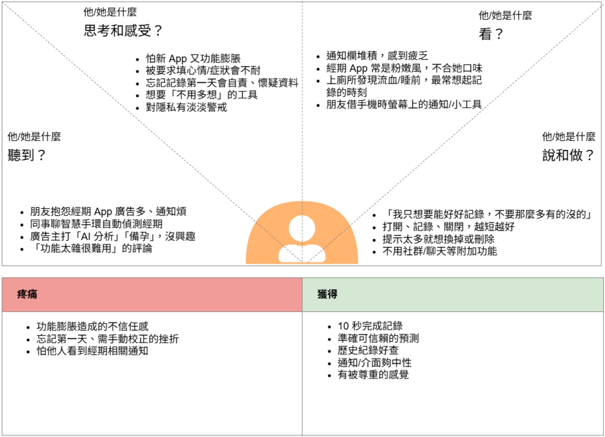
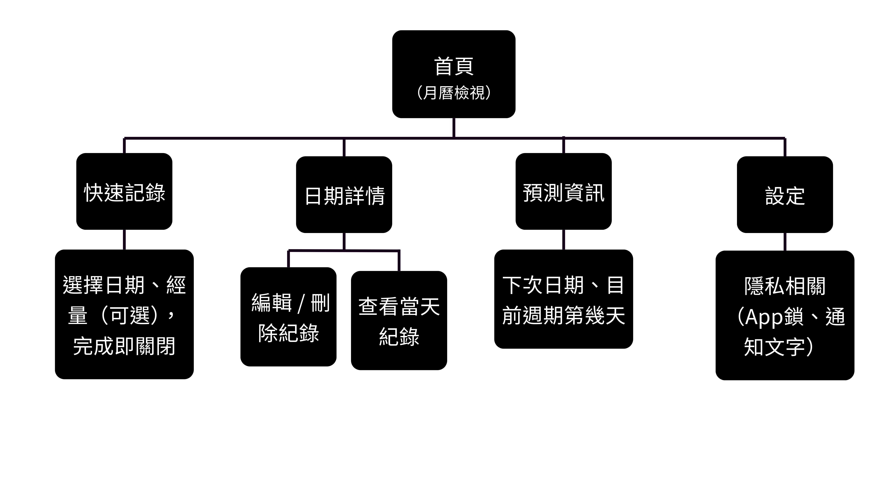
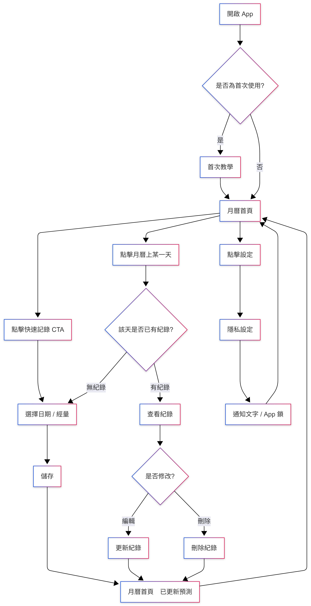
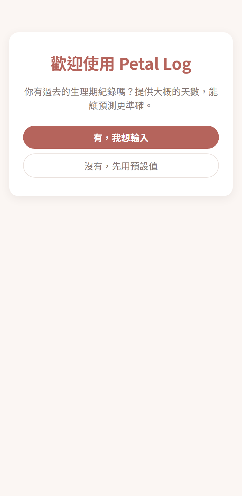
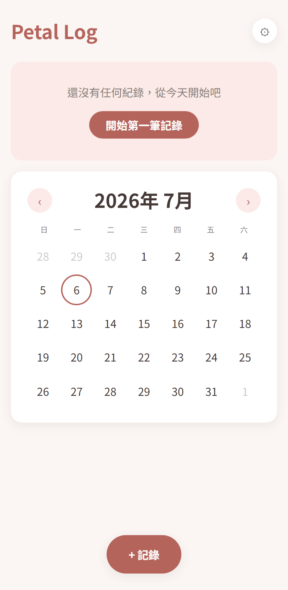
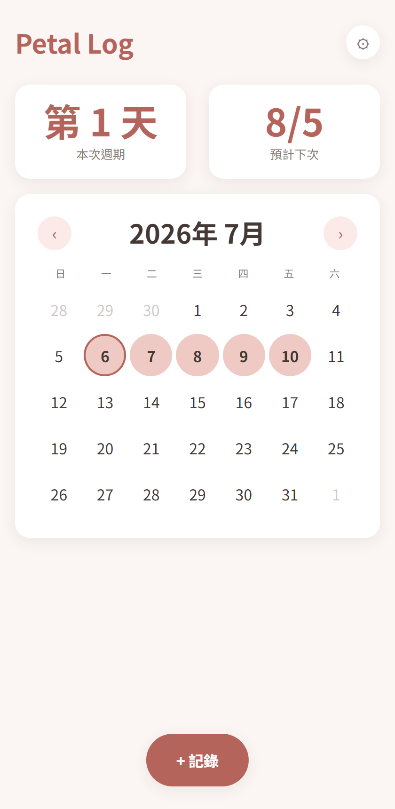
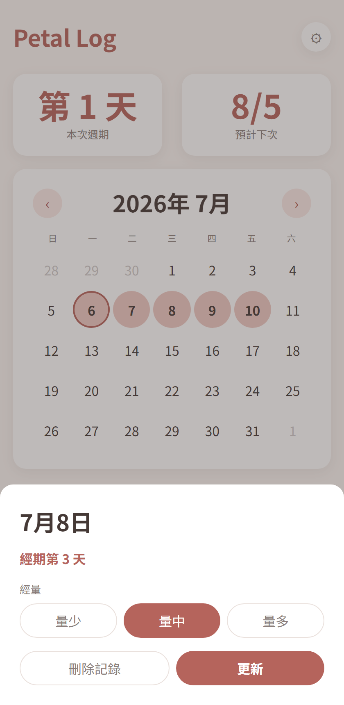
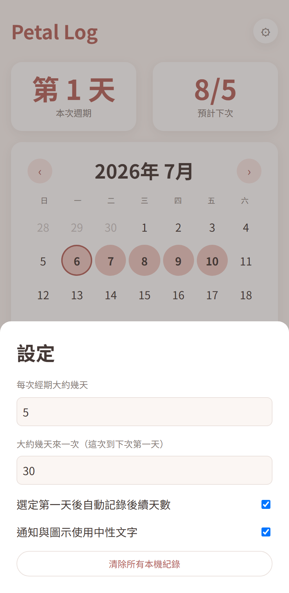

# Petal Log

> Project Type: UX Design / AI Product

Petal Log 希望成為一個「快速紀錄、清楚預測、溫柔體驗且重視隱私」的生理週期紀錄工具，協助女性更輕鬆地建立紀錄習慣，了解自己的身體節奏。

---

## Project Snapshot

| Role | Team | Project Duration | Tools |
| --- | --- | --- | --- | --- |
| Product Designer / AI Builder | 個人專案 | 2026/07 - 迄今 | 設計思考, Figma, AI Coding Tools |

---

## Context

### Project Background

隨著女性健康意識提升，越來越多人開始使用生理週期紀錄工具。然而，市面上的產品逐漸加入大量功能，例如備孕、症狀分析、健康報告與社群互動，使得原本單純的紀錄流程變得複雜。
對許多使用者而言，她們真正需要的，其實只是快速記錄生理期，並獲得可靠的週期預測。
因此，我希望設計一個專注於核心需求、降低使用負擔的生理期紀錄體驗。

### Target Users

- 主要使用者

20–35 歲

具有規律生理週期

曾使用過月經 App

但覺得：
1. 太複雜
2. 太多廣告
3. 功能太多
4. 只想快速記錄

- 次要使用者

18–25 歲

第一次開始使用生理期 App。

需要：
1. 簡單
2. 好懂
3. 沒壓力

- 暫時不考慮

例如：
1. 懷孕追蹤
2. 備孕
3. 更年期
4. 多人共享
5. 醫療用途

### Project Goals

- **建立一個具有品牌感且易於持續使用的生理期紀錄產品。**
- 10 秒內完成一次紀錄，降低紀錄壓力
- 降低學習成本，並建立持續使用習慣
- 提供可信賴的週期預測，讓資訊一眼就能理解

---

## Research & Insights

### Research Methods

- Persona
**主要人物誌**

綽號：雨薇
年齡：27歲
居住地：台北市
職業：行銷企劃

背景：使用經期紀錄 App 已經三、四年，換過兩三款，一開始都覺得新鮮，但用久了發現功能越加越多——備孕提醒、健康報告、社群動態，介面越來越擠，反而讓她想找一個「單純只做記錄」的工具。

個性與價值觀：做事講求效率、不喜歡拖泥帶水，重視「工具就該做好一件事」。在職場上習慣快速判斷、快速執行，對於介面多一步不必要的操作會直接感到不耐。

興趣、喜好：喜歡簡約設計的產品（筆記本、App、居家用品），偏好中性、不過度可愛或粉色系的視覺風格。

需求與目標：10 秒內完成一次紀錄；準確的下次日期預測；需要時能快速回頭查歷史紀錄（例如回診前）。

動機：想擺脫「被功能綁架」的使用經驗，找回單純、可控的紀錄習慣。

困擾、痛點與挑戰：常常是上完廁所發現流血、或洗完澡準備睡覺時才想到要記錄，如果流程太長會乾脆跳過；偶爾忘記哪天是第一天，若補記錄很麻煩會直接對這次的資料失去信心。

疑慮與反對理由：對「又一個新 App」抱持懷疑——擔心用沒多久又開始加功能、加廣告，變成她想逃離的樣子；也擔心朋友借手機時不小心看到通知或 Widget 內容。

能提供的解決方案：極簡的單頁快速紀錄入口、不強迫填寫心情或症狀、通知與 Widget 用中性圖示或用詞、歷史紀錄與編輯功能一樣輕鬆好用。

溝通偏好：介面文案要簡潔直接，不要有多餘的鼓勵語或裝可愛的口吻；喜歡「做完就結束」的回饋，不需要額外的儀式感。

真實的引言：「我不需要 App 提醒我心情如何，我只想知道現在第幾天、下次是什麼時候。」

**次要人物誌**

綽號：芯語
年齡：19歲
居住地：新竹市
職業：大二學生

背景：從小到大沒有固定紀錄經期的習慣，這次是因為朋友推薦才開始想試著記錄，對「怎麼記」「記了有什麼用」都還在摸索階段。

個性與價值觀：對健康相關的事情容易緊張、擔心自己「不正常」；重視隱私，不希望家人或朋友發現她在用這類 App。

興趣、喜好：常用社群媒體、喜歡溫和可愛但不幼稚的視覺風格，對介面的第一印象很重視。

需求與目標：想弄清楚自己的週期規律，尤其是「這次為什麼提前/延後」；希望有人（或介面）能簡單告訴她「這樣做就對了」。

動機：想更了解自己的身體、減少對經期的不確定感和焦慮。

困擾、痛點與挑戰：介面太空、太簡潔時反而不確定「記錄完成了嗎」；忘記記錄時容易自我懷疑（「是不是我不夠自律」），嚴重時會想乾脆放棄整個 App。

疑慮與反對理由：擔心手機被家人借用時，App 圖示、通知內容會暴露她在用經期 App；對於健康資料是否會外洩也有疑慮。

能提供的解決方案：首次使用時的溫和空狀態提示，引導她完成第一次記錄；忘記記錄時的文案要溫和（例如「沒關係，補記錄就好」而非提醒失敗）；圖示與通知維持中性、不明顯。

溝通偏好：語氣要溫和、像朋友在說話，避免醫療感或說教感的用詞；需要一點點肯定和引導，但不要過度頻繁的提示打擾她。

真實的引言：「我只是想知道自己正不正常，不想要一個 App 讓我覺得自己很失敗。」

- 同理心地圖

### Key Findings / Main Problems

| Needs | Why |
| --- | --- |
| 快速紀錄 | 不想每次花很多時間 |
| 下次日期預測 | 提前準備 |
| 查看歷史 | 回診方便 |
| 私密 | 不想尷尬 |
| 簡單 UI | 每月只用幾次，不想重新學習 |

### Key Insights

- HMW：我們如何設計一個生理期紀錄器讓使用者可以在10秒內紀錄，並確保極簡的操作介面、直覺的資料預測以及嚴格的隱私加密。
- 使用者需要的不是更多功能，而是更少的操作。

### Design Opportunities

- 快速紀錄
- 清楚的月曆呈現
- 溫和提醒
- 簡單預測

### How This Influenced the Design

Persona 與同理心地圖攤開後，主要人物誌（雨薇）與次要人物誌（芯語）對「簡單」的定義其實互相矛盾：雨薇要的是「拿掉多餘步驟」，芯語要的是「有一點引導才安心」。如果介面做到完全極簡、沒有任何提示文字，會滿足雨薇卻讓芯語不知所措；如果為了照顧芯語而加上常駐說明，又會變成雨薇討厭的「囉嗦」。

這個張力直接決定了兩個關鍵設計原則：
- **首次空狀態引導只出現一次**：新使用者第一次打開會先被溫和詢問是否有過往經期紀錄，之後就完全隱形，不會變成雨薇眼中「又一個要應付的提示」。
- **月曆/記錄流程本身不夾帶任何情緒化文案**：呼應雨薇「不需要 App 提醒我心情如何」的痛點，也避免芯語因為多餘的鼓勵語感覺被過度關注。

另外，兩人都提到「怕通知/圖示暴露自己在用經期 App」，這讓「隱私」原則從抽象口號變成具體規格——設定裡的「通知與圖示使用中性文字」開關就是直接對應這個共同焦慮而生的功能，而不是憑空加上去的隱私選項。

---

## Design Process

### Product Principles

1. **溫和** - 降低介面焦慮，不用醫療感。
2. **快速** - 10 秒完成紀錄，任何操作都不能超過三步。
3. **隱私** - 避免敏感資訊暴露。
4. **可預測** - 讓使用者知道：下一次什麼時候。
5. **平靜** - 減少通知，減少干擾。

### Service Blueprint / Sprint Questions + Map

| 階段 | 觸發 | 記錄 | 查看結果 | （選用）修正 |
| ----- | -------- | ------------ | ------- |
| Customer Actions | 發現流血 / 想到要記 | 打開 App | 看月曆、下次預測 | 回頭編輯某天紀錄 |
| Front of Stage Interaction | 解鎖手機、看到 App icon  | 點擊記錄、選日期/量 | 月曆頁顯示紀錄+預測日 | 點選歷史某天，修改內容 |
| Back of Stage Interaction | — | 寫入本地/雲端資料 | 依演算法重新計算預測  | 更新資料、重算預測 |
| Support Processes  | App icon/通知維持中性設計 | 資料加密儲存  | 預測模型、月曆渲染  | 版本記錄/資料備份機制 |

### Information Architecture

首頁（月曆檢視）── 核心導航，唯一主頁面
│
├─ 快速記錄（Modal / Bottom Sheet，非獨立頁面）
│    └─ 選擇日期、經量（可選），完成即關閉
│
├─ 日期詳情（點擊月曆上某一天觸發）
│    ├─ 查看當天紀錄
│    └─ 編輯 / 刪除紀錄
│
├─ 預測資訊（月曆頁內的區塊，非獨立頁面）
│    └─ 下次日期、目前週期第幾天
│
└─ 設定
     └─ 隱私相關（App鎖、通知文字）
     └─ （之後可擴充：提醒開關等 Should-have 項目）

### User Flow

### Prototype

這個專案沒有另外做一版靜態 Figma 稿再轉開發，而是用 Vibe Coding 直接把 Wireframe 階段的構想寫成可以互動的網頁——從 IA、User Flow 定案後就直接進入 React 元件實作，用真正可以點擊、記錄、看到預測結果的成品取代傳統的靜態原型稿，等於「原型」與「MVP」是同一份東西。

### Key Design Decisions

運用 MoSCoW 排定優先順序

| Must | Should | Could | Won't |
| ----- | -------- | ------------ | ------- |
| 生理期紀錄 | 心情紀錄 | 連接智慧型手環/手錶 | AI 醫療分析 |
| 月曆 | 症狀紀錄 | 小工具 | 社群 |
| 預估日期 | 提醒通知 | 匯出 | 聊天室 |
| 編輯紀錄 | 備註 | 備份 | 備孕模式 |

- 首頁只保留一個主要 CTA
- 使用月曆作為核心導航
- 採用柔和色彩降低醫療感
- 將歷史紀錄整合至月曆，避免多餘頁面

### UI Guide

延續「柔和但不幼稚、克制但不冷淡」的基調，在雨薇討厭的粉嫩可愛風與芯語需要的溫暖感之間找平衡；後續發現玫瑰色搭霧綠色容易讓人聯想到紅綠燈式的警示對比，因此輔色改為霧紫色。

| 用途 | 色票 | 說明 |
| --- | --- | --- |
| 主色（經期日） | `#B5645C` 霧玫瑰 | 按鈕、圖示、強調文字 |
| 輔色（預測日） | `#9B8AC4` 霧紫 | 取代原本的霧綠，避開紅綠警示聯想 |
| 背景 | `#FBF6F3` 暖白 | 降低臨床感 |
| 文字 | `#453936` 暖灰黑 | 比純黑柔和 |

字級系統以「一眼看懂天數」為核心：最大的 Display 字級（2.5rem）只留給「第幾天」「幾月幾號」這類使用者最常掃視的數字，其餘標題與內文則維持克制的層級，避免畫面被過多字重搶走焦點。

---

## Solution

### Final Solution

Petal Log 提供一個以月曆為核心的生理週期紀錄網站，讓使用者能快速記錄、生理週期預測與查看歷史紀錄。
[MVP 網站](https://lolalayaya.github.io/Petal-Log/)

### Main Features

- MVP：
生理期紀錄
月曆檢視
預測下一次生理期
歷史紀錄
編輯紀錄

- 未來規劃：
情緒追蹤
症狀紀錄
提醒通知
資料匯出
AI 洞察建議

### Key Screens

- 首次使用引導

第一次打開先溫和詢問是否有過往紀錄，之後就完全不再出現，不會變成常駐的干擾提示。

- 月曆首頁（空狀態）

沒有任何紀錄時，用溫和文案取代空白畫面的不確定感，並保留唯一的主要 CTA。

- 月曆首頁（已有紀錄＋預測）

選定第一天後自動填色整段經期天數，上方同時顯示「目前第幾天」與「預計下次日期」。

- 日期詳情

點選月曆上任一天可查看/編輯/刪除當天紀錄；若該天屬於某次經期，會額外顯示「經期第幾天」。

- 設定

可調整經期天數、週期天數、是否自動記錄後續天數，以及通知與圖示是否使用中性文字。

### Design Rationale

大部分關鍵決策都是在主要與次要人物誌的需求張力之間做取捨：月曆維持極簡、快速記錄不超過三步，滿足雨薇的效率需求；首次空狀態引導、溫和的錯誤/忘記記錄文案，則是專門為芯語的不確定感設計，但刻意讓它只在需要的時刻出現，不會演變成雨薇討厭的常駐干擾。

預測演算法的設計也是同樣邏輯：一開始用使用者自填或預設的天數起步，隨著實際紀錄累積（≥2 次週期）自動改用真實平均值，讓「準確」這件事不需要使用者手動校正，也不會因為資料不足就顯得不可靠。

### Why This Design

Petal Log 想解決的不是「功能不夠多」，而是「功能太多、選項太多，導致原本單純的紀錄變複雜」。因此每一個設計決策都反過來問：這個功能/文案/提示，是不是在增加使用者的負擔？月曆作為唯一導航、彈出層取代多頁面、MoSCoW 嚴格排除備孕/社群/AI 醫療分析等功能，都是同一個信念的延伸——好用的紀錄工具，應該讓使用者做得更少，而不是看得更多。

---

## Impact

### Testing Approach

目前以自動化瀏覽器測試（Playwright）走過完整流程——首次引導、快速記錄、月曆填色、預測計算、編輯/刪除、設定切換——確保每個功能實際可操作，而不只是看起來完成。過程中也實際抓出並修正了兩個真實的邏輯錯誤：一是手動輸入未來日期的紀錄時，「目前第幾天」會因為抓錯參考週期而消失；二是點選日期時，經量選項會因為元件沒有正確重新掛載而短暫顯示錯誤的預設值。尚未進行正式的使用者易用性測試。

### Results

從設計文件到可公開瀏覽的 MVP 網站一次到位，部署在 [Petal Log](https://lolalayaya.github.io/Petal-Log/)，涵蓋 MoSCoW 中全部的 Must-have 功能：生理期紀錄、月曆、預估日期、編輯紀錄。

### Future Improvements

- 找主要／次要人物誌兩類真實使用者實際測試，驗證「首次引導只出現一次」「自動填充後續天數」等假設是否真的降低使用負擔
- 累積更多真實紀錄後，回頭檢視預測演算法的準確度，並視情況調整平均週期/經期天數的計算方式
- 依 MoSCoW 的 Should-have 清單，接續實作心情紀錄、症狀紀錄、提醒通知等功能

---

## Reflection

### What Went Well

- 以研究驅動設計決策
- 聚焦 MVP，避免功能膨脹
- 成功建立一致的設計語言

### What I Would Do Differently

- 擴大使用者訪談樣本
- 加入更多情境測試
- 驗證不同年齡層需求

### Key Learnings

- 學會從研究洞察轉化為產品策略
- 練習完整的 UX 設計流程
- 將 AI 工具融入設計與開發協作
- 平衡使用者需求、產品目標與技術可行性

### Skills Demonstrated

- 使用者研究：競品分析、使用者訪談、Persona、顧客旅程地圖
- UX 設計：資訊架構、User Flow、原型製作、易用性測試
- 產品思維：產品策略、MVP 規劃、功能優先順序排定、設計原則制定
- UI 設計：視覺設計、設計系統、響應式設計
- 開發實作：Vibe Coding、前端開發、GitHub 版本控管