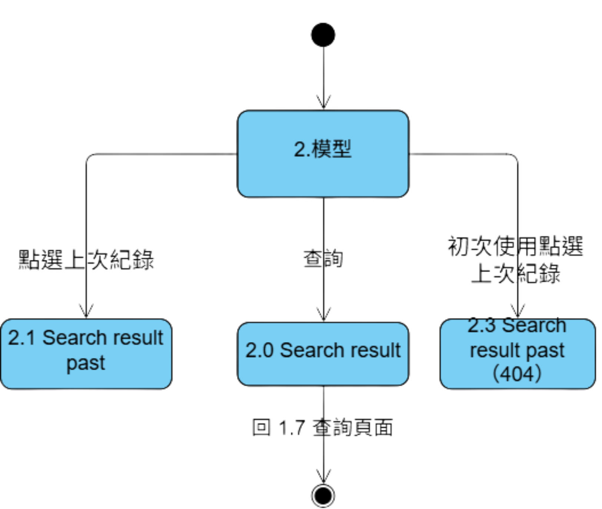

# 尋保家 Quest for Home Safety

> Project Type: UX Design / AI Product

與業師合作開發 AI 保險媒合介面，運用決策樹加速業務員找到適合推銷給顧客的商品。

---

## Project Snapshot

| Role | Team | Project Duration | Tools | System Scope |
| --- | --- | --- | --- | --- |
| Product Designer / Frontend Developer | 5 人（系上專題） | 2023.09 – 2024.05 | 決策樹、Figma、VS Code、phpMyAdmin、Excel、Word | 商品分類首頁、客戶資料輸入、決策樹媒合結果頁 |

---

## Context

### Project Background

保險業務員在拜訪客戶前後，需要同時整合客戶的基本資料、需求偏好與大量保單條款，才能判斷該推薦哪一項商品。這個比對過程高度仰賴業務員個人的經驗與記憶，經驗較淺的新人常常得花更多時間翻找資料，媒合品質也容易因人而異。

### Target Users

保險銷售業務員，尤其是需要快速比對客戶條件與商品內容的第一線人員。

### Project Goals

- 讓業務員在單一介面內完成客戶資料輸入與商品媒合，不必再切換多份文件與系統
- 用決策樹取代純憑經驗的判斷，降低不同業務員之間的媒合品質落差
- 讓經驗較淺的新人也能快速找到適合推薦的商品，不需大量教育訓練

---

## Research & Insights

### Research Methods

- 訪談保險業務員，了解實際拜訪客戶前後的工作流程
- 整理訪談內容為 User Story，釐清每個角色在系統中的期待行為

### Key Findings / Main Problems

透過訪談與 User Story 整理，發現業務員最大的困擾在於「資料分散、比對耗時」——客戶資料、保單條款與過往銷售經驗分別存在不同地方，每次媒合都要重新翻找比對。

### Key Insights

聚焦在如何減少業務員的決策步驟、並讓系統即時回饋媒合結果，讓業務員不需要自己逐項比對保單條款。

### Design Opportunities

- 我們如何讓業務員在最短時間內看到符合客戶需求的商品，不必自己比對保單條款
- 我們如何用決策樹取代口耳相傳的銷售經驗，讓新人也能有一致的媒合品質
- 我們如何用分類清楚的首頁，降低業務員瀏覽商品類別時的尋找時間

### How This Influenced the Design

從 User Story 中發現業務員最在意的是「輸入資料後能多快看到推薦結果」，因此我們把設計重心放在「選擇類別 → 輸入客戶資料 → 決策樹運算 → 直接看到推薦商品」這條最短路徑上，並用分類清楚的首頁降低瀏覽時的認知負擔。

---

## Design Process

### Activity Diagram

透過活動圖釐清業務員從登入、選擇保險類別到取得推薦結果的完整操作流程，確認每個步驟之間的先後關係。

### State Diagram

- 會員身分狀態圖：定義業務員帳號在系統中的登入、驗證與權限狀態轉換。

- 模型狀態圖：定義客戶資料從輸入、決策樹運算到輸出推薦結果的狀態轉換。

### Prototype

[Figma Prototype](https://lolala.pse.is/Quest_for_Home_Safety)

---

## Solution

### Final Solution

完成一套以決策樹為核心的保險媒合原型：業務員登入後，先透過分類清楚的首頁選擇保險類別，再輸入客戶的基本資料，系統即依決策樹分析結果，列出最適合推薦的保險商品。

### Main Features

- 分類清楚的商品首頁，依保險類型快速導覽
- 客戶基本資料輸入表單
- 決策樹驅動的商品媒合結果頁

### Key Screens

- 首頁

可以透過點擊對應的圖示，了解不同類別的保險，讓保險商品分類清晰化，減少業務員尋找時間。

- 模型匹配結果

透過輸入客戶的基本資料，運用決策樹進行分析，計算出適合推銷的保險商品。

### Design Rationale

選擇決策樹而非更複雜的機器學習模型，是因為保險商品的媒合條件相對明確、規則可被拆解，決策樹的判斷邏輯對業務員來說也更容易理解與說明給客戶聽。

---

## Impact

### Testing Approach

受限於專題時程，尚未進行正式的業務員使用者測試，而是由團隊成員實際扮演業務員角色，依照訪談整理出的 User Story 走過完整流程，確認決策樹輸出的推薦結果符合預期。

### User Feedback

- 團隊內部走查時，多數認為分類首頁能有效縮短尋找商品的時間
- 決策樹的判斷條件仍偏簡單，遇到客戶條件較複雜時，推薦結果的說服力有待加強

### Iteration Focus

- 優化決策樹的判斷條件，讓推薦結果更貼近實際業務員的銷售邏輯
- 補上推薦結果的原因說明，讓業務員能對客戶解釋為什麼推薦這項商品

### Results

完成可運作的原型，驗證「用決策樹輔助保險媒合」這個方向可行，並作為系上專題的成果展示。

### Future Improvements

- 導入正式的業務員使用者測試，驗證決策樹推薦結果在實際銷售情境中的實用性
- 擴充決策樹規則，涵蓋更多元的客戶條件與保單組合

---

## Reflection

### What Went Well

團隊在時程內完成從資料庫、決策樹邏輯到前端介面的完整原型，也順利透過訪談與 User Story 釐清業務員最核心的需求。

### What I Would Do Differently

若能在專題初期就規劃使用者測試的時間，會更有機會及早驗證決策樹的推薦結果是否真的符合業務員的實際銷售邏輯，而不只是團隊內部的假設。

### Key Learnings

- 使用者導向：從模糊需求出發，學會以訪談方式釐清問題，避免套用既有假設。
- 溝通能力：與他人合作時，透過持續討論，減少摩擦與誤解。
- 自學成長：在實作過程中自學決策樹原理與前端介面語法，提升問題解決能力。

### Skills Demonstrated

- 決策樹邏輯設計與資料庫串接（phpMyAdmin）
- 前端介面實作，配合決策樹輸出動態呈現推薦結果
- 使用者訪談與 User Story 撰寫
