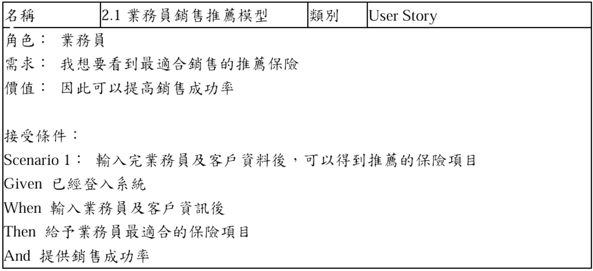
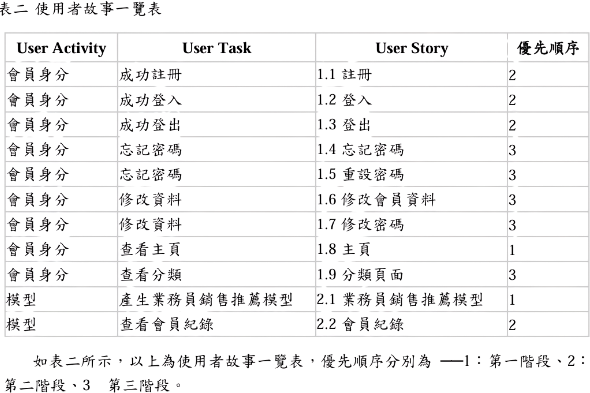
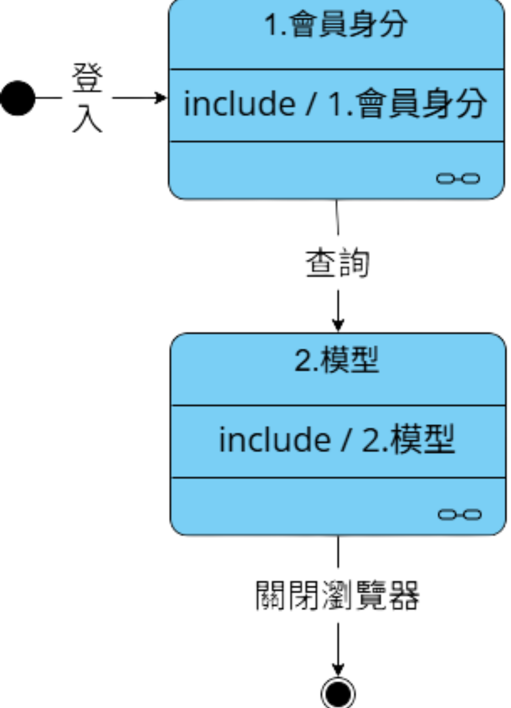
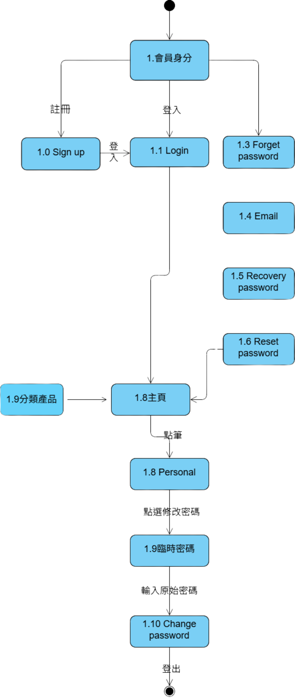
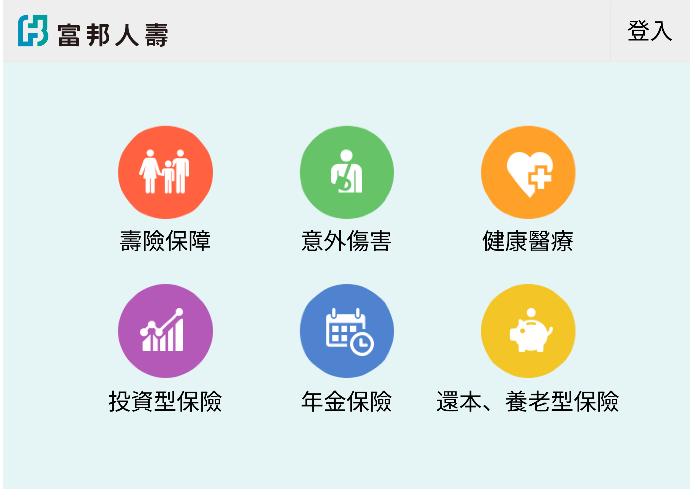

# 尋保家 Quest for Home Safety

> Project Type: UX Design / AI Product

與業師合作開發 AI 保險介面，加速業務員找到適合推銷給顧客商品的流程。

---

## Project Snapshot

| Role | Team | Project Duration | Tools |
| --- | --- | --- | --- | --- |
| Product Designer / Frontend Developer | 5人（系上專題） | 2023.09 – 2024.05 | 決策樹、Figma、VS Code、phpMyAdmin、Excel、Word |

---

## Context

### Project Background

業務員在短時間內需整合多種客戶資料與保單資訊。

### Target Users

保險銷售業務員。

### Project Goals

- TBD
- TBD
- TBD

---

## Research & Insights

### Research Methods

- 訪談
- User Story

### Key Findings / Main Problems

- User Story 一覽表

### Key Insights

- 聚焦減少決策步驟與即時回饋推薦結果的方式。

### Design Opportunities

- TBD
- TBD
- TBD

### How This Influenced the Design

TBD

---

## Design Process

### Activity Diagram

- 活動圖

### State Diagram
- 會員身分狀態圖 

- 模型狀態圖 

### Prototype

[Figma Prototype](https://lolala.pse.is/Quest_for_Home_Safety)

---

## Solution

### Final Solution

TBD

### Main Features

- TBD

### Key Screens

- 首頁

可以透過點擊對應的圖示，了解不同類別的保險，讓保險商品分類清晰化，減少使用者尋找時間。
- 模型匹配結果

透過輸入一些客戶的基本資料，運用決策樹進行分析，計算出適合推銷的保險商品。

### Design Rationale

Optional.

### Why This Design

Optional.

---

## Impact

Optional.

### Testing Approach

TBD

### User Feedback

- TBD
- TBD
- TBD

### Iteration Focus

- TBD
- TBD
- TBD

### Results

TBD

### Future Improvements

- TBD
- TBD
- TBD

---

## Reflection

### What Went Well

TBD

### What I Would Do Differently

TBD

### Key Learnings

- 使用者導向：從模糊需求出發，學會以訪談方式釐清問題，避免套用既有假設。
- 溝通能力：與他人合作時，透過持續討論，減少摩擦與誤解。
- 自學成長：在實作過程中自學模型原理與前端介面語法，提升問題解決能力。

### Skills Demonstrated

- TBD
- TBD
- TBD

