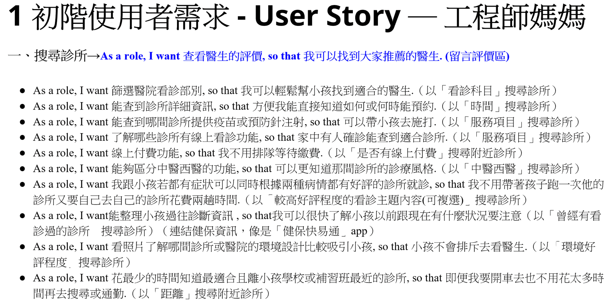
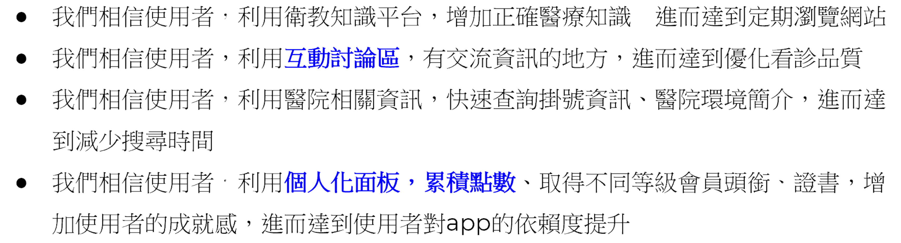
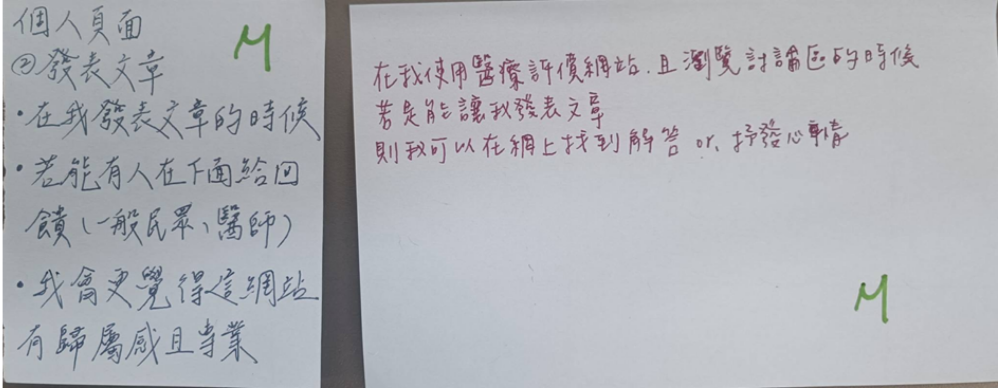

# 醫療好評網 Taiwan Physician Rating Website

> Project Type: Product Owner / UX Design

完成醫療平台原型，透過使用者測試驗證導覽結構並提升搜尋任務成功率。

---

## Project Snapshot

| Role | Team | Project Duration | Tools |
| --- | --- | --- | --- |
| Product Designer / Frontend Developer | 8 人（資管、資工、心理、德語系成員） | 2023.09 – 2023.12 | 敏捷開發、Persona、便利貼、Figma、FB Ads |

---

## Context

### Project Background

病患與家屬在就醫前常缺乏可信管道了解他人對醫生的實際評價，導致難以快速找到適合的醫生。

### Target Users

有看診需求、需要參考他人評價的患者與其家屬

### Project Goals

- 上線 2 年後，50% 使用超過半年的使用者願意推薦給他人
- 10% 曾使用過的使用者會主動推薦給他人

---

## Research & Insights

### Research Methods

- Persona

- User Story

### Key Findings / Main Problems

- 假說

### Key Insights

- HMW
我們如何讓使用者願意用社群軟體分享。

### Design Opportunities

- 我們如何讓討論區達到每個用戶都留言過。
- 我們如何讓網站達到瀏覽次數破千。
- 我們如何使用衛教遊戲讓新手每日登入一次。
- 亮點採納

### How This Influenced the Design

透過這些簡單的問題反思，找出網站可以成功吸引到使用者的方式與策略。

---

## Design Process

### User Test Flow

### Story Boarding

### Prototype

[Figma Prototype](https://lolala.pse.is/Taiwan_Physician_Rating_Website)

### Key Design Decisions

MoSCoW
- 透過 MoSCoW 優先級排序開發的先後順序。

- 並依據每項功能所需要的製作時間給予單位。

---

## Solution

### Final Solution

[網站模擬](https://winniekuo-1025.github.io/hoscommentweb/coupon.html)

### Main Features

### Key Screens

TBD — 待補上代表性畫面截圖（如首頁、醫生評價頁、點數兌換頁）

---

## Impact

### Testing Approach

- 在 FB 社團發文的方式，進行易用性測試訪問。
- 總共邀請 3 位不同背景使用者進行任務測試（發文、留言、分享、點數兌換）。

### User Feedback

- 3 位使用者皆於發文與兌換流程中產生完成不確定感。
- 主要因回饋提示不足。

### Future Improvements

- 當使用者完成某項操作時，會在上面跳出通知，讓使用者確定有完成操作。

---

## Reflection

### What Went Well

跨領域團隊（資管、資工、心理、德語系）順利整合彼此觀點，透過 MoSCoW 排序讓開發優先順序更清楚，也如期完成易用性測試並取得具體的使用者回饋。

### What I Would Do Differently

測試中發現「回饋提示不足」會讓使用者對是否完成操作感到不確定，若能在原型階段就補上完整的操作回饋提示，測試結果會更貼近正式版體驗；也會考慮邀請更多使用者參與測試，以取得更全面的結果。

### Key Learnings

- 時間管理：要透過零碎時間討論與製作，學習在時限內收斂重點功能。
- 領導：在面對不同背景的夥伴，要用不同角度與語言才有辦法輕鬆溝通協調彼此想法。
- 表達&理解能力：當聽不懂老師所需要的內容時，可以透過多問多聽等方式來理解。

### Skills Demonstrated

- 使用者研究：Persona、User Story 建立與假說驗證
- 優先順序決策：以 MoSCoW 框架排序功能開發順序
- 易用性測試設計與執行、使用者回饋分析
- 跨領域團隊協作與敏捷開發流程

