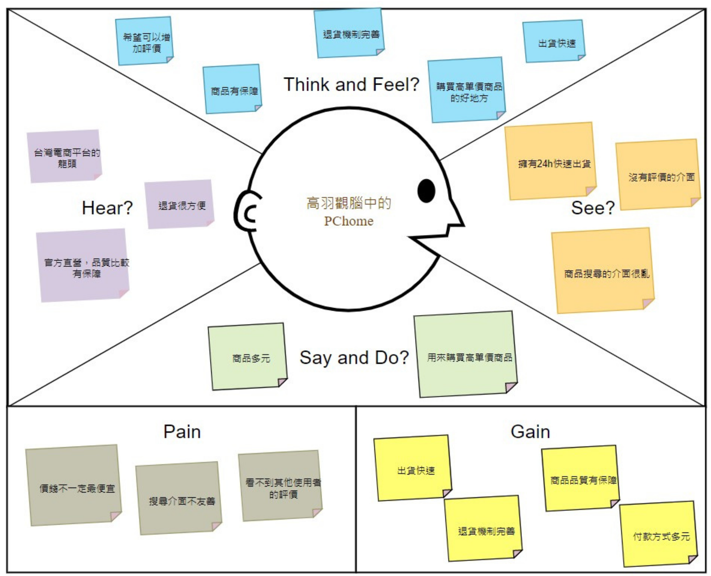
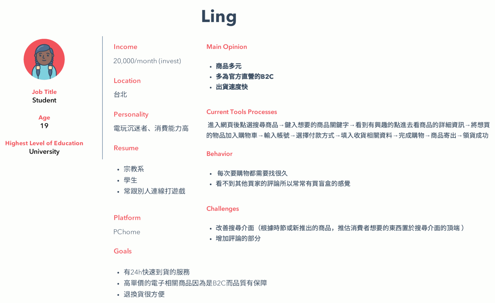
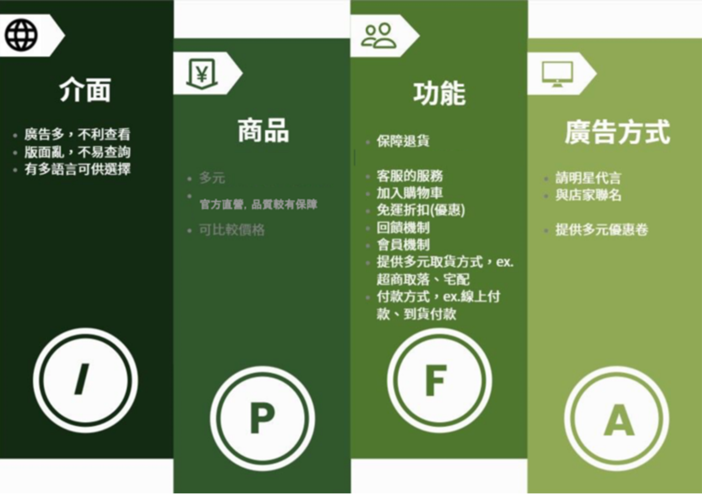
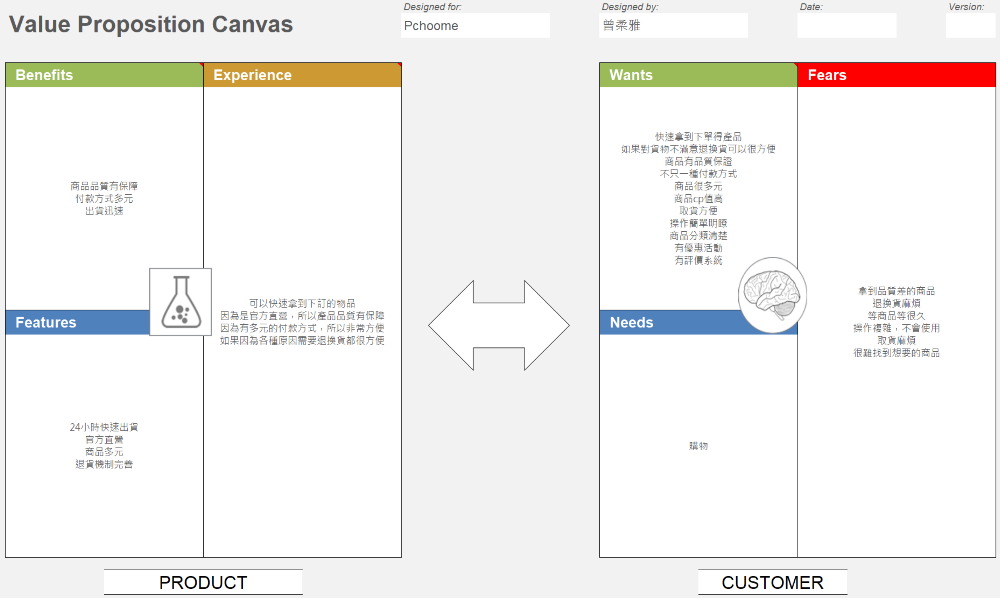
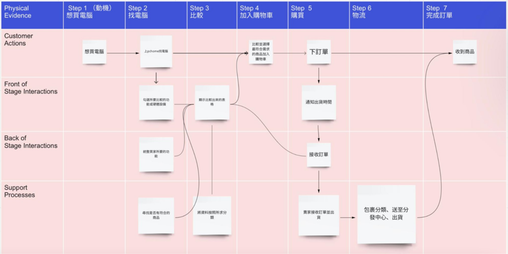
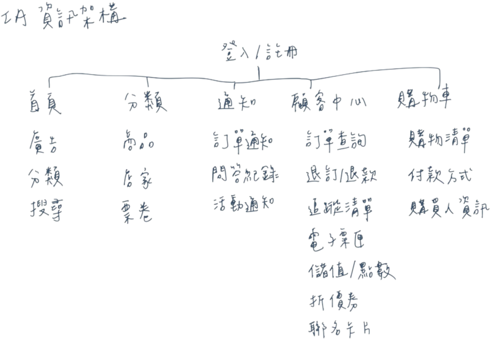
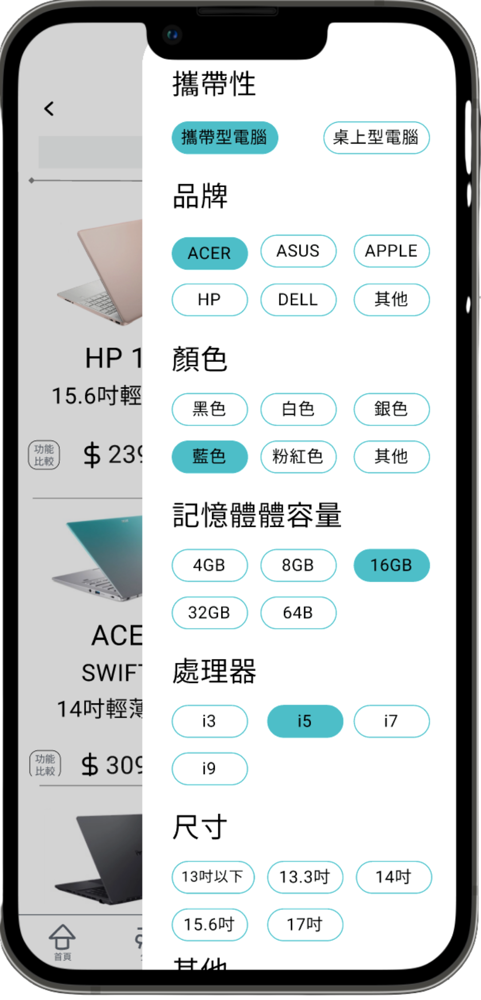
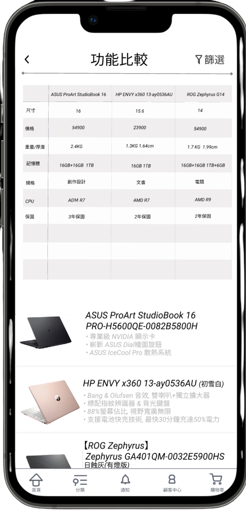
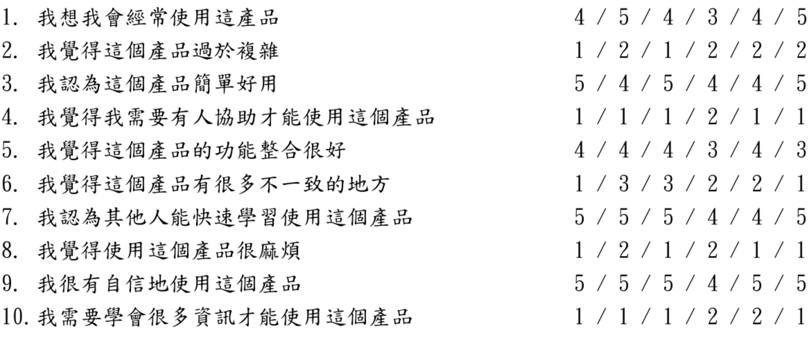

# 電商平台介面優化 Innovation and Design Thinking

> Project Type: Service Design / UX Research

以服務流程與使用情境為核心，整理問題並提出可被驗證的改善方向。

---

## Project Snapshot

| Role | Team | Project Duration | Tools | System Scope |
| --- | --- | --- | --- | --- |
| UX Designer / Usability Researcher | 5人（系上作業） | 2021.09 – 2022.01 | 服務設計、Miro、Figma | 單一商品頁面、顧客中心、購物車的功能、訂單的通知 |

---

## Context

### Project Background

在學期初時對各自所提出的許多電商平台進行篩選和協調後選擇針對PChome進行創新設計，我們一致認為PChome雖然是台灣數一數二知名且商譽很好的電商平台，然而PChome的介面非常的複雜，每每打開介面都覺得眼花撩亂。
我們認為用聚集廣告、分類用圖案標示能夠簡化PChome的介面並會大幅改善見介面的使用程度。除此之外，我們認為當我們要選擇購買電子產品時，時常因為不熟悉電子配備、功能或是記性不夠良好無法將每一台候選商品的特性記住，因此我們決定創造出一個比較篩選的介面，使用者可以透過更細項的分類方式去篩選出自己想要的商品，抑或可以透過選取自己喜歡的商品後進行綜合比較。

### Target Users

常使用電商平台網購的人

### Project Goals

- 簡化介面、分類廣告以提升使用的方便度。
- 透過篩選功能讓顧客可以更快速找到自己心目中喜歡的商品，不必再受到選擇上的困難。

---

## Research & Insights

### Research Methods

- 同理心地圖

在我們受訪者的腦海中，他所聽到的PChome是台灣電商的龍頭、退貨機制很完善而且是官方直營所以沒有甚麼品質上的堪憂。在購買的過程中他感到很安心，出貨快速退貨的機制也很棒。
然而他看見了PChome沒有評價的功能所以希望可以增加評價。在使用PChome的時候他也認為介面太過雜亂。那在整體使用過後，他給與他人對於PChome的評價是商品很多元但同時比較適合用來購買高單價的商品。
統整來說，PChome的缺點為價錢和其他電商比較不一定比較便宜，搜尋介面不友善而且看不到其他使用者的評價。優點為出貨快速，退貨機制完善、商品品質有保障然後付款方式多元。

- Persona

我們這次採訪的人是一位來自宗教系的同學，這位同學時常和別人一起打遊戲，且因為他一個月有兩萬的生活費，所以他的消費能力比一般人高了一些。因為愛打遊戲的關係，他很常會去使用PChome。
他喜歡PChome的原因是因為他有24小時快速到貨的機制，比起其他電商，就算價格比較高，但品質還有在應急的時候會讓PChome贏過其他家。那大家應該都有在網購的時候踩雷，但因為退貨機制太麻煩所以覺得就算了。PChome因為是B2C，所以退貨機制很完善。
這位同學覺得少數的缺點是因為商品很多然後分類沒有很方便使用，所以每次買東西都要找很久。再來就是PChome沒有買家評論的功能，所以沒辦法看到其他人的回饋。他希望PChome可以改善搜尋介面跟增加評論的部分。

### Key Findings / Main Problems

- 親和圖

- - PChome的瀏覽介面雖然擁有多種語言可以瀏覽，但不易分類、有太多廣告、頁面太複雜且凌亂，讓使用起來的感覺並不方便與舒服。
- - PChome的商品多元且因為是官方直營，因此品質上有一定的保障，且在價格上可以進行比較可以令顧客感到更安心。
- - PChome擁有許多功能，除了普遍在購買時會運用到的購物車，還有免運折價券折扣、會員福利機制、多元取貨及付款方式，以及擁有完整的客服以及完善的退貨機制。
- - PChome的廣告方式非常多元，除了最普遍的提供優惠券外，還會與店家聯名以及邀請明星進行代言。

### Key Insights

- 價值主張圖

- - Benefits:
    出貨速度快、取貨選項多、優惠券、會員制度、快速便利、付款多元、品質優良
- - Features:
    二十四小時快速到貨、品牌合作、官方直營、退貨機制完善、線上活動
- - Experience:
    有官方直營購入假貨機率降低，退貨機制完善、可以快速拿到商品、有多元支付方法，非常方便、容易聯絡客服
- - Wants:
    有對比功能可以篩選想要的商品、獲得高ＣＰ值商品、評價系統、簡單操作介面
- - Needs:
    將商品規劃分得更清楚、以直播或影片方式讓顧客更了解商品內容
- - Fears:
    實體與網站展現的不符合、網頁操作複雜
- - Customer substitutes:
    優惠釋放、運用更完善、簡單的介面提高顧客購買意願、多加利用網購的便利性

### Design Opportunities

- 電商平台沒有評價的功能，因此顧客沒有辦法得知其他用戶的使用經驗，只能單方面的聽取官方說詞，因此增加評價機制可以讓我們更了解商品，比較不會買錯東西。

### How This Influenced the Design

TBD

---

## Design Process

### Service Blueprint

若是想要購買電腦，只要打開電腦並搜尋PChome的介面，勾選所有需要的性能以及規格便能顯示出比較出來的表格讓顧客能夠將最符合自己需求的商品加至購物車中。（勾選功能是為統整買家的需求並會將資料按照所求分類給予更完的體驗。）下完訂單後便會通知出貨時間，PChome會接收訂單，賣家就會開始出貨的程序。在包裹分類運送後便會出貨至買家手上。

### Information Architecture

### Prototype

[Figma Prototype](https://lolala.pse.is/Innovation_and_Design_Thinking)

### Key Design Decisions

Optional.

- TBD
- TBD
- TBD

---

## Solution

### Final Solution

TBD

### Main Features

- TBD

### Key Screens

- 篩選

在小分類所搜尋到的商品裡，我們可以透過右上角的篩選，選擇想要的規格。來找到想要的商品。
- 功能比較

在選擇完想要的商品後，會出現如上圖所示的頁面（上面的那個表格在手機裡可以放大，避免字太小而閱讀有些吃力）
上面會出現整體規格比較的總覽，包含有選取的各個品項及功能；底下會有選取的商品圖片、名稱以及特色。

### Design Rationale

Optional.

### Why This Design

Optional.

---

## Impact

### Testing Approach

- 受測者：共6位，年齡分別為15、20、22、40、45、50歲
（以下結果依此順序排列）
1. （一）	情境一：
- - 情境建立1
    「你決定要買一台筆電，非常急需所以越快下訂單越好。」
- - 任務1
    「你的需求是處理器i5（含）以上、輕薄、13吋以上，且費用為三萬以下的文書筆電。」
- - 目標1
    按下登入鈕後，跳轉至首頁，並由首頁的大分類和小分類中來到商品介面，藉由篩選找到符合基本條件的產品，並透過比較功能（列出更完善資訊的功能）選出最符合上述需求的產品，加入購物車並結帳。
- - 結果分析
    任務完成：100%、100%、95%、90%、95%、100%
    完成時間：1’48、2'12、1’23、2'36、3'41、2’52
    任務錯誤：不知道怎麼從首頁進入產品頁面、對「功能比較」的定義比較不熟悉、有些人一開始沒想到可用篩選鍵搜尋，因此過程耗費較多時間做各個產品的資訊查詢。
- - 解決方法：
    若做出實體，可用搜尋引擎直接搜尋產品，即可解決情境一的問題。
2. （二）	情境二
- - 情境建立2
    「由於你不喜歡新買的滑鼠，因此想辦理退貨。」
- - 任務2
    「退貨完畢後請聯繫客服。」
- - 目標2
    按下登入鈕後，跳轉至首頁，並由首頁的功能欄來到顧客中心，藉由訂單退貨的選項辦理退貨，並使用客服功能詢問產品相關退貨資訊。
- - 結果分析
    任務完成：80%、85%、85%、80%、80%、85%
    完成時間：2’36、2'58、3’03、2'47、3'41、2’32
    任務錯誤：找不到退貨的位置、不知道怎麼從首頁到顧客中心（不知道在功能欄裡）
- - 問題分析
    因為退換貨是非常常見且重要的功能，我們可以再研究如何把退換貨的功能移至更顯眼、顧客能更快速找到的地方。

### User Feedback

- 系統易用性量表 SUS（依序給分）:

- 介面下方就有程式主要功能可以點選直接到那一頁，非常方便，另外我也蠻喜歡整體的版面，看起來很舒服。
- 原本就有使用PChome習慣，但因為版面凌亂所以不常使用，如果改成現在這樣的話會變得清楚明瞭一百倍，我會願意更常使用PChome來購物。
- 新改版的商品頁面較原先舒適整齊許多，其他介面也不會像原本一樣雜亂。
- 我平常本來就不常網購，所以對電商平台的操作不太清楚，連蝦皮也常常找不到我需要的功能，這介面雖然有把整體操作功能簡單化了，但我覺得應該能再做得更好。
- 個人很喜歡這個網頁，對於我們這些上年紀的人來說，使用上並沒有遇到太大的困難，跟其他APP比起來，操作算十分簡易了!
- 平常就有網購的習慣，主要以蝦皮為主，因為PChome的介面過於複雜，所以只有幾次購買經驗，我認為這次你們的作品表現還不錯，有把畫面變整齊乾淨，且原PChome的功能也都有盡量保持住，很好!

### Iteration Focus

- TBD
- TBD
- TBD

### Results

TBD

### Future Improvements

- TBD
- TBD
- TBD

---

## Reflection

### What Went Well

TBD

### What I Would Do Differently

TBD

### Key Learnings

- 仔細觀察：從日常購物體驗中發現潛在痛點，培養以使用者為中心的思考習慣。
- 使用者訂定的重要性：不同年紀的人在購物會有不同習慣，要明確定義TA的特性。

### Skills Demonstrated

- TBD
- TBD
- TBD

